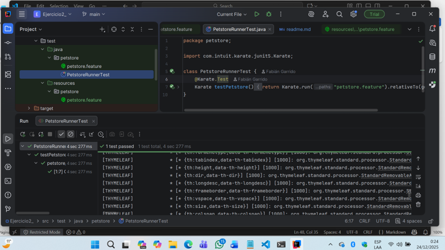

Ejercicio de APIS - PetStore con Karate
=======================================

Tecnologías y versiones:
- JDK 11
- Maven 3.9.x
- Karate 1.4.0
- JUnit 5
- Sistema operativo: Windows 10/11 (compatible con Linux/Mac)

Prerrequisitos:
1. Instalar JDK 11 y configurar JAVA_HOME.
2. Instalar Maven y verificar con "mvn -v".
3. Instalar Git para clonar y subir repositorio.

Pasos de ejecución:
1. Clonar el repositorio: git clone https://github.com/FabianGM/Ejercicio2_.git
2. Entrar a la carpeta: cd petstore-karate
3. Ejecutar pruebas: mvn clean test (simplemente ejecutar play en el IntelliJ IDEA 2025.3.1 en la carpeta:
\src\test\java\petstore\PetstoreRunnerTest.java)
   
4. Revisar reportes:
   - target/karate-reports/karate-summary.html
   - target/karate-reports/petstore.petstore.html

Casos cubiertos:
- Añadir mascota (POST /pet)
- Consultar mascota por ID (GET /pet/{id})
- Actualizar mascota a "sold" (PUT /pet)
- Consultar por estatus (GET /pet/findByStatus)

